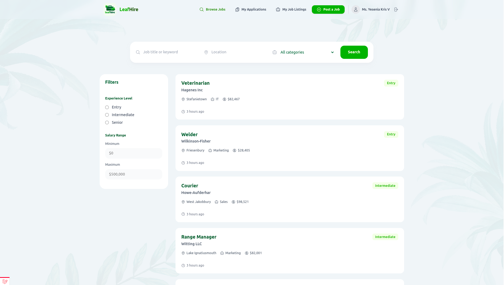

# 🌿 LeafHire - Job Platform 

[](https://laravel.com/) [](https://www.php.net/) [](https://tailwindcss.com/) [](LICENSE)



**LeafHire** is a modern, nature-inspired **job board platform** built with **Laravel and TailwindCSS**, focused on clean UI, reusable components, and scalable backend architecture.

Designed as a **portfolio-grade project**, it demonstrates real-world patterns like authentication, filtering, pagination, relationships, and job applications.

## Designed for
- Job board platforms
- Laravel portfolio projects
- Recruiter-facing demos
- Clean UI + backend architecture showcases

## Features

### Core
- Job listings with pagination (desktop & mobile)
- Job detail pages with related jobs by employer
- Employer profiles and relationships
- Job search with filters and query scopes
- Job application flow with redirect handling

### Authentication
- Login & logout system
- Conditional UI based on auth state
- Protected job application routes
- Validation via reusable form components

### UI & UX
- TailwindCSS v4 setup
- Fully responsive layout
- Mobile dropdown navigation
- Reusable UI components (buttons, inputs, cards)
- Sidebar filters for job search
- Polished header with dynamic states

### Architecture & DX
- Query logic extracted from Blade into controllers
- Custom Eloquent query scopes
- Factories and seeders with relationships
- Docker-based local development
- Laravel Debugbar for development
- Clean commit history following Conventional Commits


## Tech Stack
- Laravel 12  
- PHP 8.2+  
- TailwindCSS v4  
- Blade Components  
- MySQL / PostgreSQL  
- Docker  
- Laravel Debugbar  


## Installation

### 1. Clone the repository
```bash
git clone https://github.com/DarlanSchmeller/leafhire-laravel.git
cd leafhire-laravel
```

### 2. Install dependencies
```bash
composer install
npm install && npm run build
```

### 3. Environment setup
```bash
cp .env.example .env
php artisan key:generate
```

### 4. Run migrations & seeders
```bash
php artisan migrate --seed
```

## 🐳 Docker Setup (Recommended)
The project includes a Docker configuration for local development.


```bash
docker compose up -d
```

Update your .env file according to the Docker setup (see .env.example).


## Project Highlights

### Job Search (Query Scope)
- Search logic extracted into an Eloquent scope
- Clean, reusable filtering
- Keeps controllers thin and readable

### Blade Components
- Buttons with dynamic styles
- Reusable form inputs with validation support
- Cards and layout components

### Relationships
- Employers → Jobs
- Users → Job Applications
- Factories reflect real database relationships


## 🧪 Development Tools
- Laravel Debugbar (dev-only)
- Factories & seeders for rapid setup
- Conventional commit messages
- Clean, readable commit history

## 📄 License
This project is open-sourced under the MIT license.